## TME RI TEXTUEL


```python
from Index import Index
from ParserCACM import ParserCACM
from TextRepresenter import PorterStemmer
from Weighter import Binary, TF, TF_IDF, Log, Log_plus
from EvalMeasure import EvalIRModel
import numpy as np
import os.path
import time
```


```python
# model_type = Random | Vectoriel | Okapi | Language | PageRank | Hits | MetaModel
fname = "data/cacm/cacm.txt"
query_file = "data/cacm/cacm.qry"
relevance_file = "data/cacm/cacm.rel"
```

### Random


```python
t1 = time.time()
type = "Random" 
eval_platform = EvalIRModel(fname,query_file,relevance_file,model_type=type)
models_recall, models_inter_prec, models_AP = eval_platform.eval_std()
print "Exec duration(s) : ",time.time()-t1
```

    Indexing database...Done!
    <class 'IRmodel.RandomModel'>
    Evaluation of our models ...
    
    
    
    Model :  Random


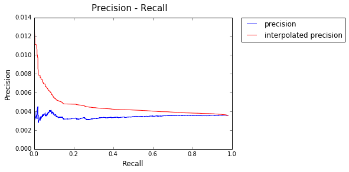


    AP:  0.00489365936907
    Exec duration(s) :  37.8984589577


### Vectoriel


```python
t1 = time.time()
type = "Vectoriel" 
eval_platform = EvalIRModel(fname,query_file,relevance_file,model_type=type)
models_recall, models_inter_prec, models_AP = eval_platform.eval_std()
print "Exec duration(s) : ",time.time()-t1
```

    Indexing database...Done!
    Creating models...Done!
    <class 'IRmodel.Vectoriel'>
    Evaluation of our models ...
    
    
    
    Model :   Binary


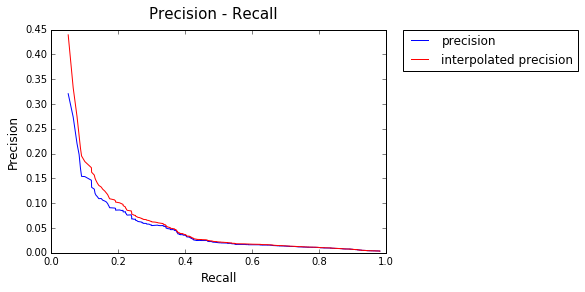


    AP:  0.123849729889
    
    
    Model :   Text Frequency


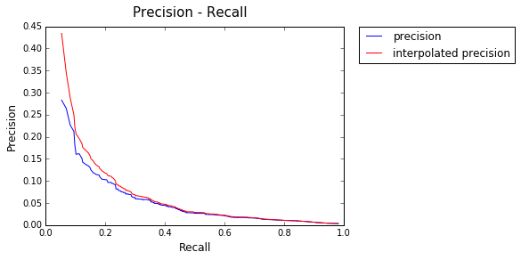


    AP:  0.13215026906
    
    
    Model :   Text Frequency - Inverse Document Frequency


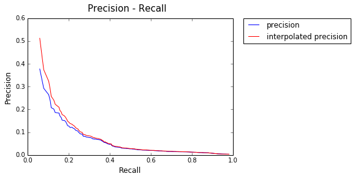


    AP:  0.154529641961
    
    
    Model :   Log


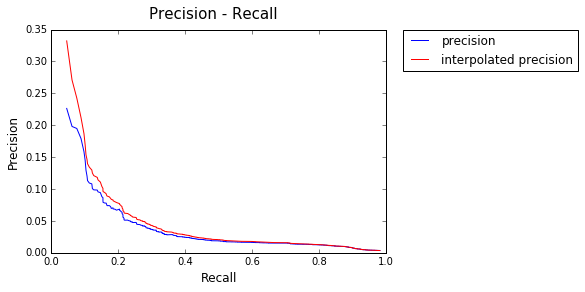


    AP:  0.120869800911
    
    
    Model :   Log +


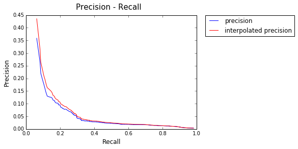


    AP:  0.143917859729
    Exec duration(s) :  171.119966984


### Okapi : k1=2, b=0.75


```python
t1 = time.time()
type = "Okapi" 
eval_platform = EvalIRModel(fname,query_file,relevance_file,model_type=type)
models_recall, models_inter_prec, models_AP = eval_platform.eval_std()
print "Exec duration(s) : ",time.time()-t1
```

    Indexing database...Done!
    L moy :  4925.14700285
    <class 'IRmodel.Okapi'>
    Evaluation of our models ...
    
    
    
    Model :  Okapi


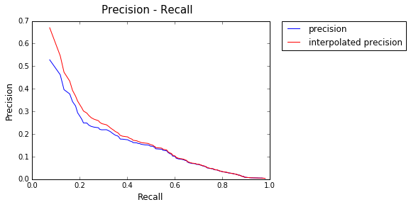


    AP:  0.264364808856
    Exec duration(s) :  540.410473108


### Language : Lambda =0.2


```python
t1 = time.time()
type = "Language" 
eval_platform = EvalIRModel(fname,query_file,relevance_file,model_type=type)
models_recall, models_inter_prec, models_AP = eval_platform.eval_std()
print "Exec duration(s) : ",time.time()-t1
```

    Indexing database...Done!
    Init of Language model
    <class 'IRmodel.LanguageModel'>
    Evaluation of our models ...
    
    
    
    Model :  Language Model


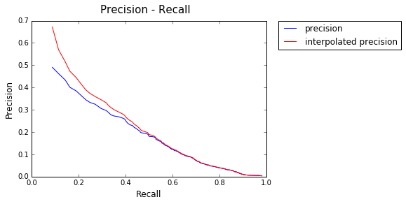


    AP:  0.307058115209
    Exec duration(s) :  580.641823053


### PageRank  : N=25, K=unlimited, d=0.85


```python
t1 = time.time()
type = "PageRank" 
eval_platform = EvalIRModel(fname,query_file,relevance_file,model_type=type)
models_recall, models_inter_prec, models_AP = eval_platform.eval_std()
print "Exec duration(s) : ",time.time()-t1
```

    Indexing database...Done!
    <class 'IRmodel.RankModel'>
    Evaluation of our models ...
    
    
    
    Model :  PageRank


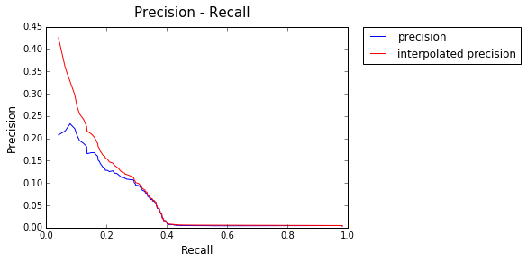


    AP:  0.133320317291
    Exec duration(s) :  1294.32549


### Hits : N=25, K=unlimited


```python
type = "Hits" 
eval_platform = EvalIRModel(fname,query_file,relevance_file,model_type=type)
models_recall, models_inter_prec, models_AP = eval_platform.eval_std()
```


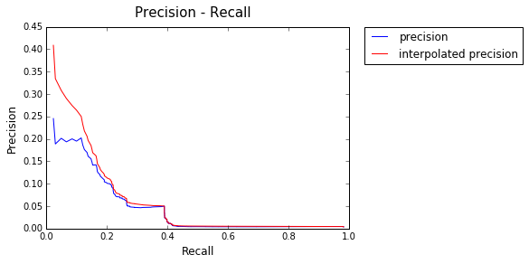


### MetaModel


```python
t1 = time.time()
type = "MetaModel" 
eval_platform = EvalIRModel(fname,query_file,relevance_file,model_type=type)
models_recall, models_inter_prec, models_AP = eval_platform.eval_std()
print "Exec duration(s) : ",time.time()-t1
```

    Indexing database...Done!
    Grad theta : 0.2
    Training achieved with Grad_theta <  0.1  !
    Number of queries required : 4
    <class 'IRmodel.MetaModel'>
    Evaluation of our models ...
    
    
    
    Model :  MetaModel


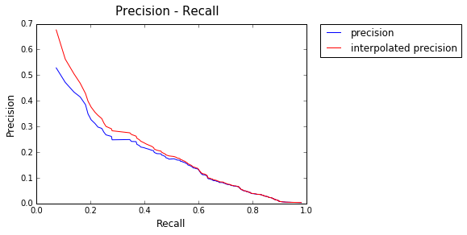


    AP:  0.285386850473
    Exec duration(s) :  2393.91500187


```python
for idx,f in enumerate(eval_platform.models[0].listFeaturers.listFeaturers):    
    print "featurers :",str(f.model)[:-25],">"
    print "theta :",eval_platform.models[0].theta[idx],"\n"
```

    featurers : <IRmodel.Vectoriel  >
    theta : [ 0.01994691] 
    
    featurers : <IRmodel.Vectoriel  >
    theta : [ 0.88962339] 
    
    featurers : <IRmodel.Vectoriel  >
    theta : [ 0.06195642] 
    
    featurers : <IRmodel.Vectoriel  >
    theta : [ 0.20448804] 
    
    featurers : <IRmodel.Okapi  >
    theta : [ 1.82525156] 
    
    featurers : <IRmodel.LanguageModel  >
    theta : [ 1.11311955] 
    
    featurers : <IRmodel.RankModel  >
    theta : [ 0.74651456] 
    

